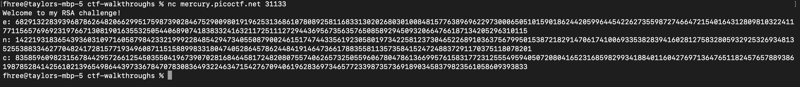

Here we are asked, what happens if d is too small? We are also given a port to netcat to for some further information.



First thing to notice is that this is connected to RSA given the output, "Welcome to my RSA Challenge." Further, we are presented with the c, e, and n variables as well as the hint about d. The encrypt/decrypt process in RSA looks like:


Source: ChatGPT

From another google, we know that if we have too small of a d for the decryption process we can use something called Wiener's attack. Using [this](https://cryptohack.gitbook.io/cryptobook/untitled/low-private-component-attacks/wieners-attack) resource (a very good one) we can find a quick python library and script that do this automatically. Pull it down and modify with our data:

```
#!/usr/bin/env python3
import owiener
from Crypto.Util.number import long_to_bytes

#--------Data--------#

N = 138735828550469701079326796573647315441236082785801129441952231928207274187737373149006976186513686851861767168570767509739268390477341862946504711035060401746765214818491397019233728725641210318265570316551967824415097817599165307210914682871873553523824890514647581387976310024198648732785708063845495783317
e = 61403177536511733190689221079666298648185593421455252320992437651113133026281256355375664379855708873307769721646804406395978701372663574563418007628807527278082593971957628418090118459281616088174127682120502329147351330841221535572410238904436277253325216241933233280465465774936173570344119823433332171419
c = 85508839129705505735599729037114801313361001319640212034256502187911217066435525962066868321576320023572504586825062189324440732880480074095902229509199485588992353366753195162638579042942334506987076096428784728190608898806851353943193075287686045642664004773383964210004679107434269459396059084001117242913

#--------Wiener's attack--------#

d = owiener.attack(e, N)

if d:
    m = pow(c, d, N)
    flag = long_to_bytes(m).decode()
    print(flag)
else:
    print("Wiener's Attack failed.")
```

and get the flag!

