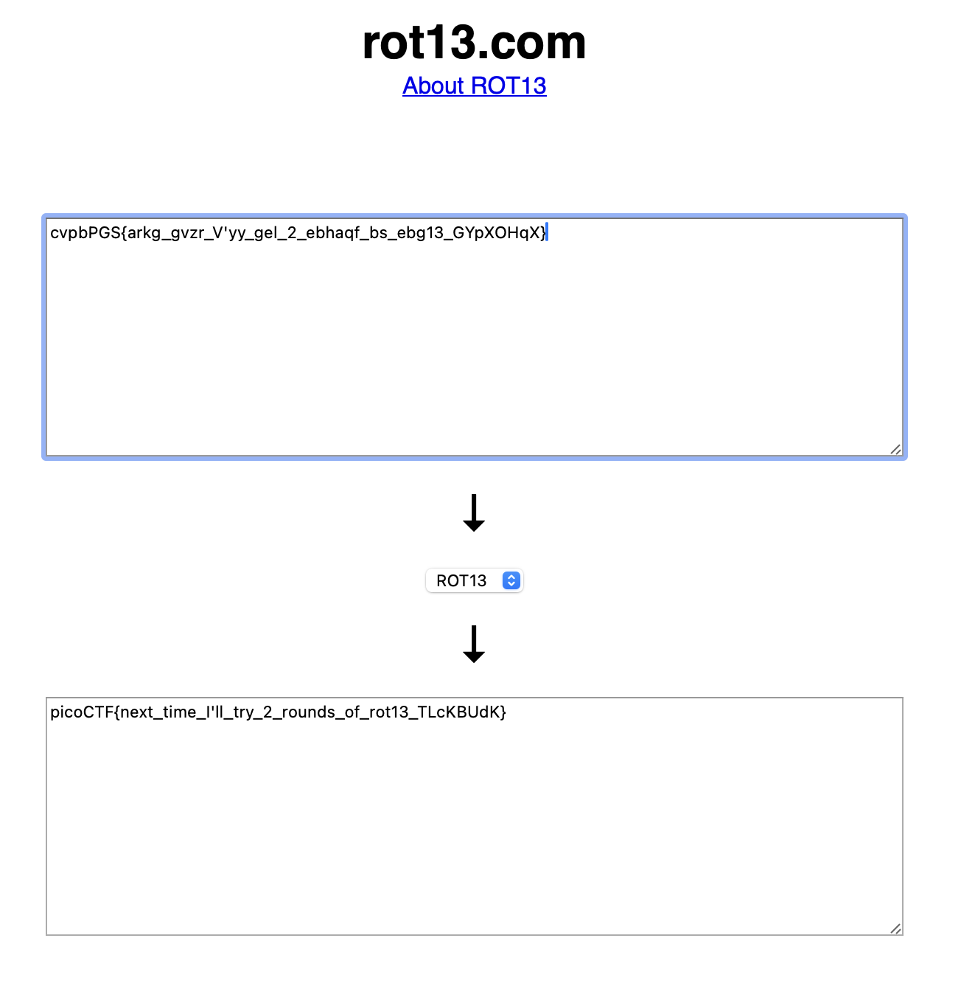

The description asks, "Do you know what ROT13 is?" After googling you should be able to find that ROT13 is a special type of Caesar cipher where the letters map back to each other. For example, c -> p and p -> c. Therefore, we can use an online solver (I used rot13.com) to decode the cipher. We could also write a python script, use the codecs library, etc. but this is the easiest way I could think of.

