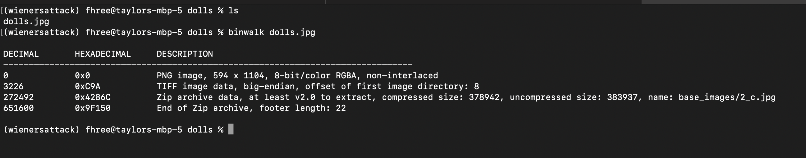
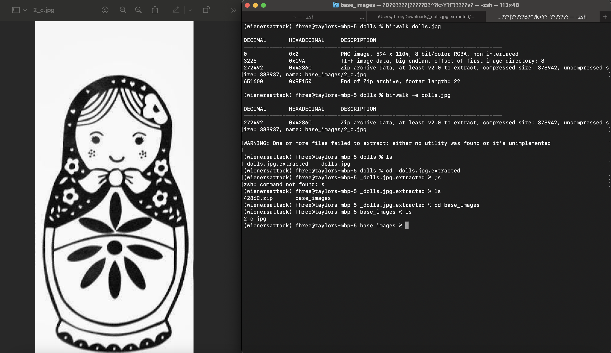
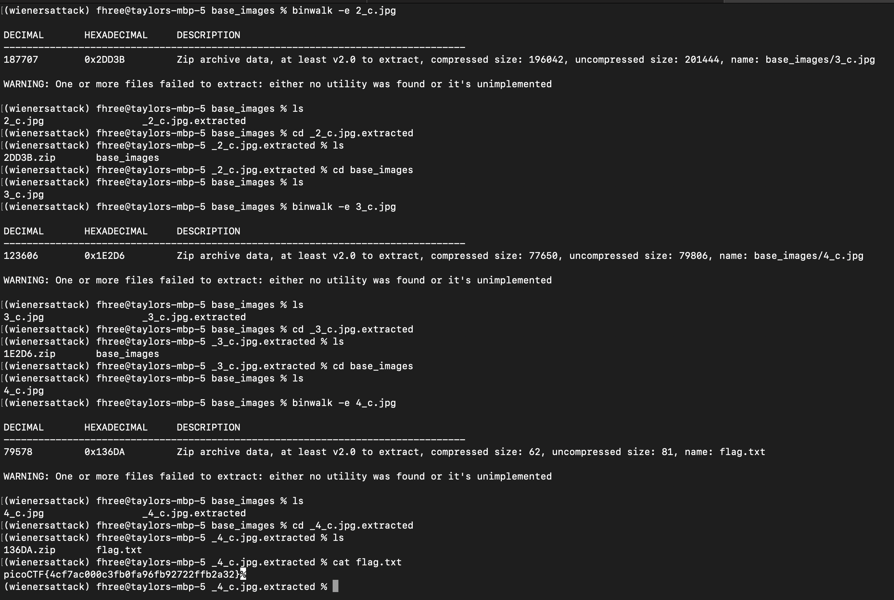

For this challenge, you are presented with a picture of a matryoshka doll with seemingly no other information. However, if you cat out the data in the file you see some seemingly uninteresting binary data. Unsure where to go from here, I used the tool [binwalk](https://github.com/ReFirmLabs/binwalk) to see if it could detect any files within the doll. Binwalk was created for firmware analysis but can really be used to see if there are files inside of other files in any case. Binwalk gives us some results!

Lets extract the file and see what we get:

Another doll... lets just do this until we cant anymore.

Nice! If we keep binwalking the doll images that arise, we eventually recover a flag.txt with what we need!