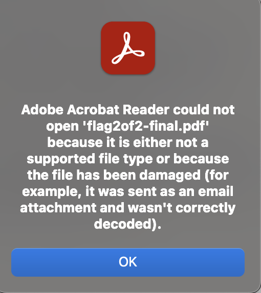
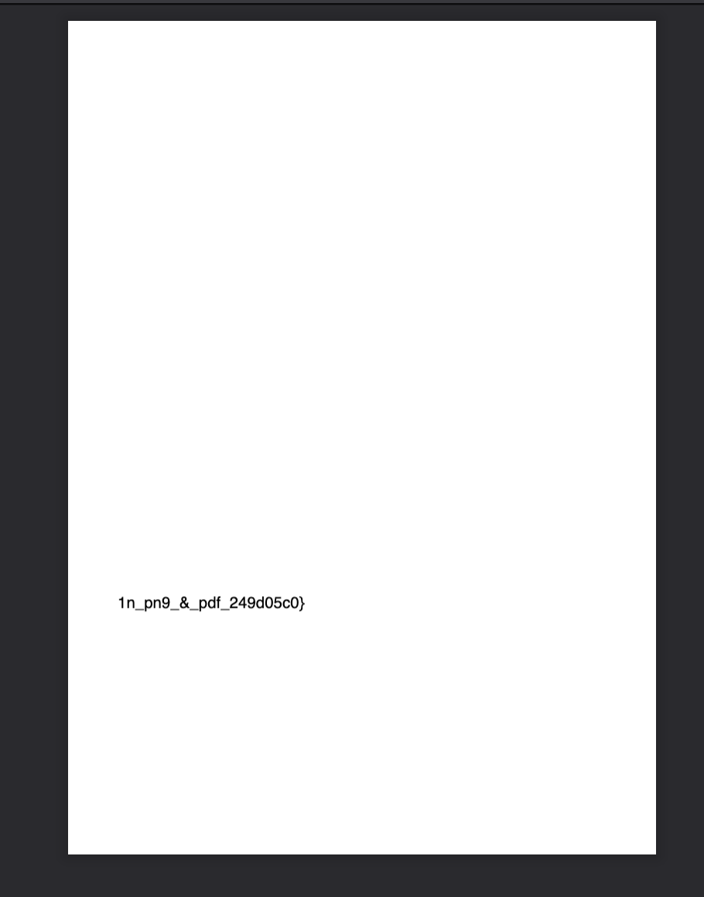
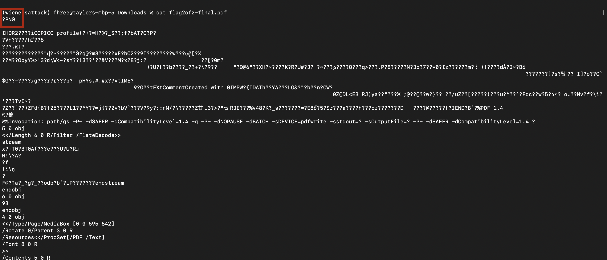
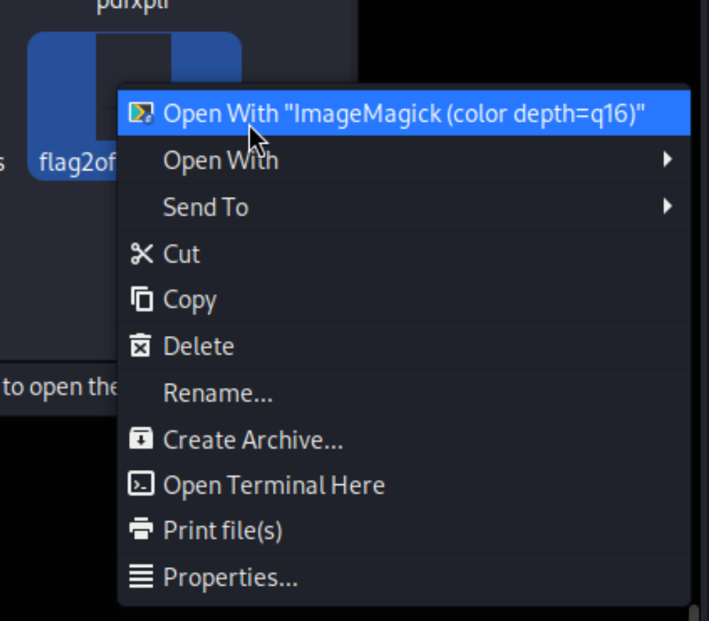
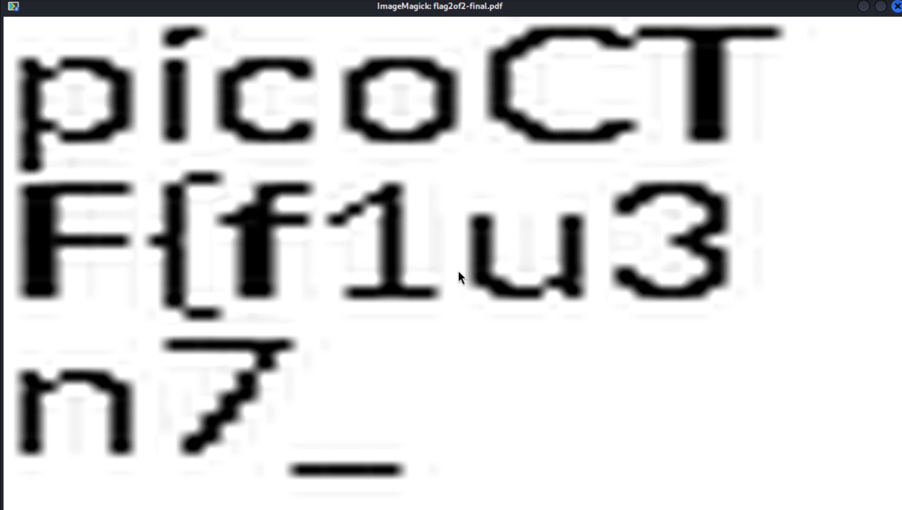

Initially we are presented with a pdf file called "flag2of2-final.pdf". First thought is to open the pdf. I use vscode because it makes adobe acrobat upset:

In vscode:

We notice the second part of the flag is in the pdf, as advertized. My next idea is to see the actual content of the file to see if the first part is hiding somewhere in the metadata or something. So, I just use my terminal to cat it out. I find a PNG header at the very top, so I either need to extract the image or open it in a different software.

After trying to find some software to open it as an image on mac I ran into some issues (using photos and preview) so then I decided to try it out on my kali vm and found an image viewer that opened a different file:

and then the image:

Therefore, we can combine and get the flag!

For what its worth, the first time I did this problem I noticed the PNG at the top of the output after catting it out but I did not try to open it as an image. Instead what I did was use the tool [foremost](https://www.kali.org/tools/foremost/) to extract the image and look at it. Both ways work!
