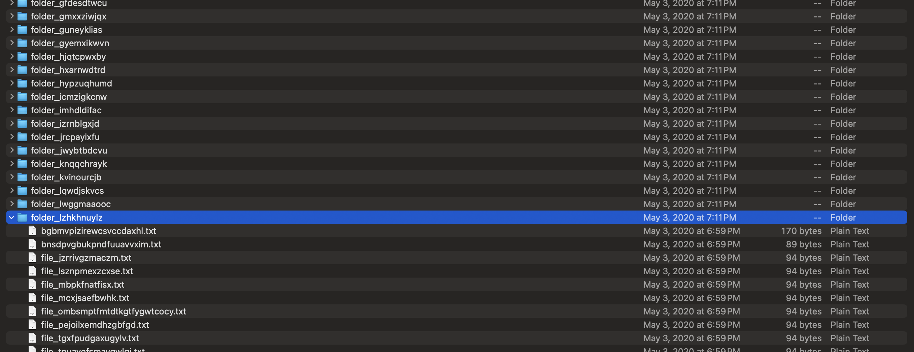
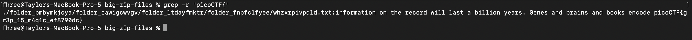

Here we are presented with a very large zipfile containing lots of subdirectories and text files.



We can use the grep command to search for the flag recursively throughout the entire directory using this command:

```
grep -r "picoCTF{"
```

and we find the flag!

