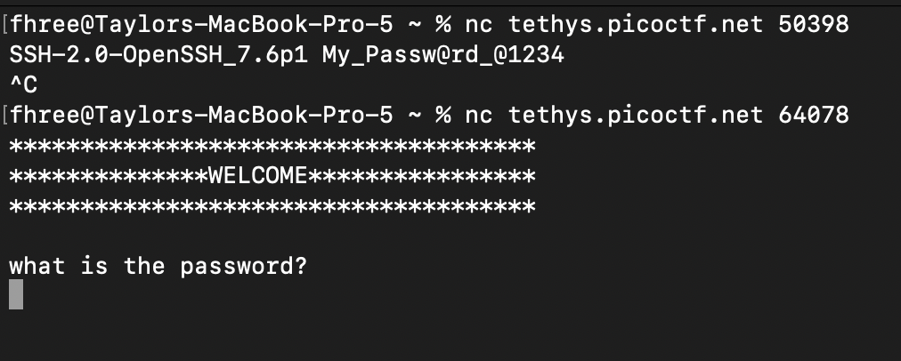
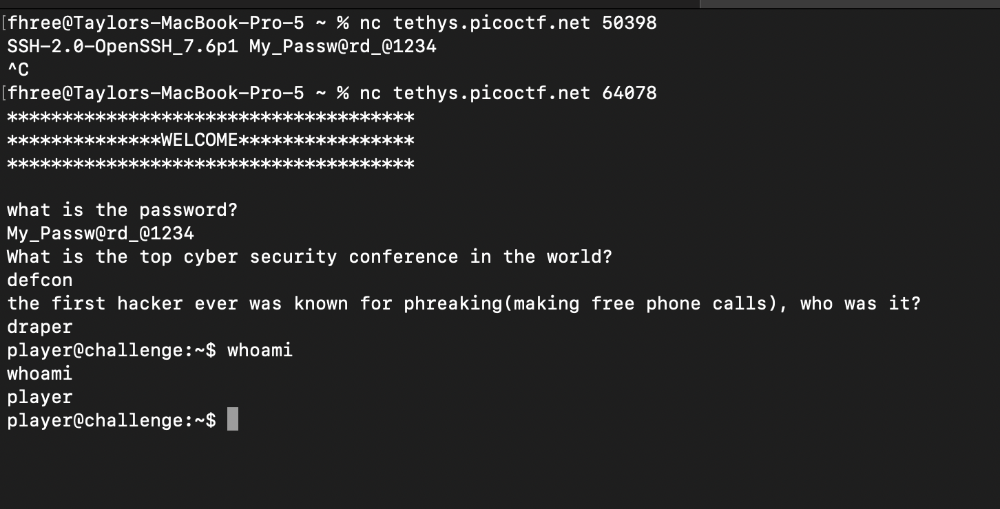
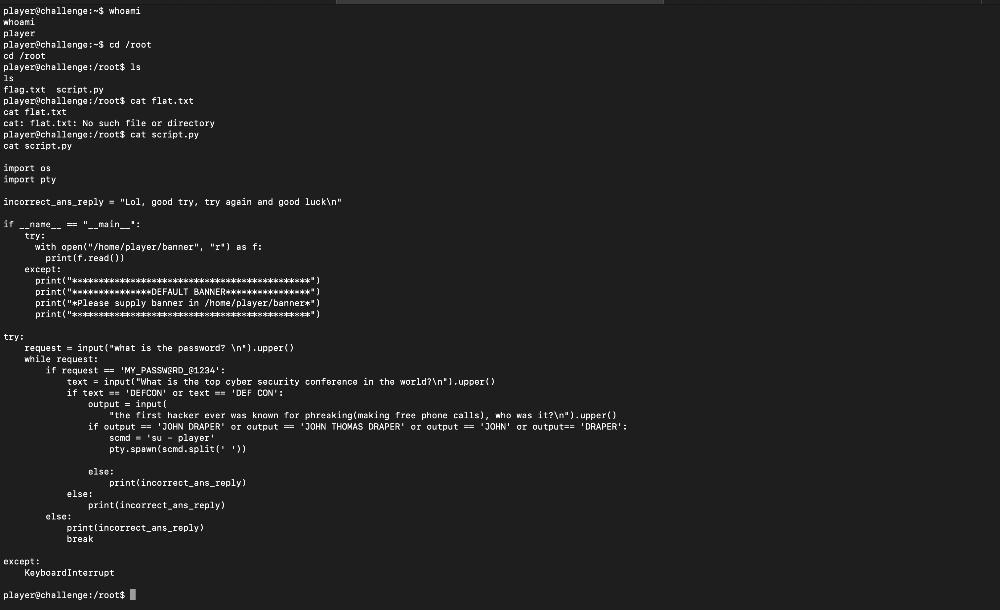
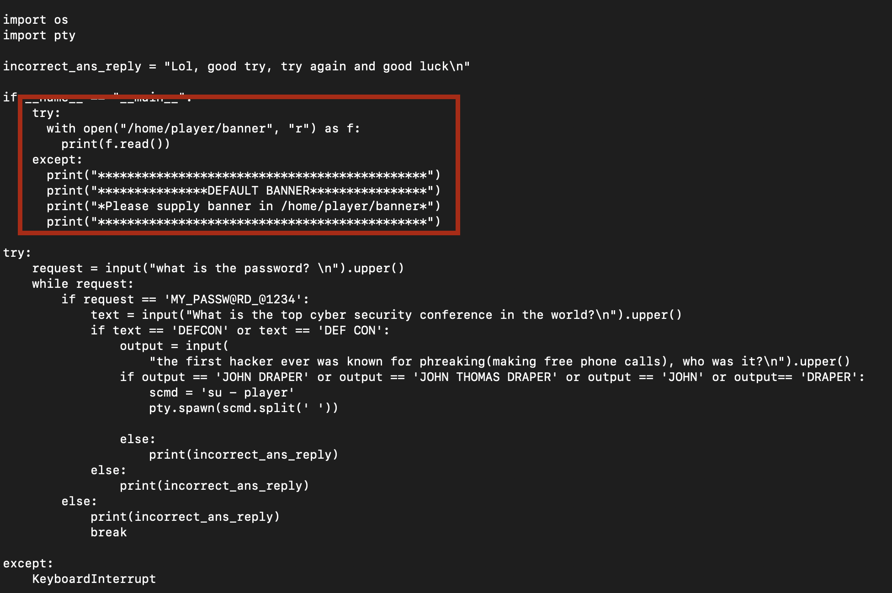
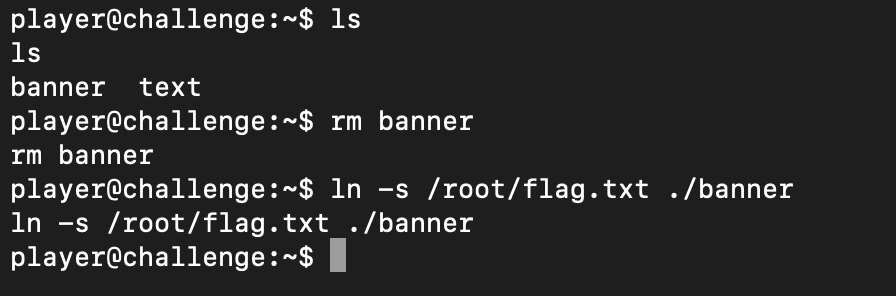
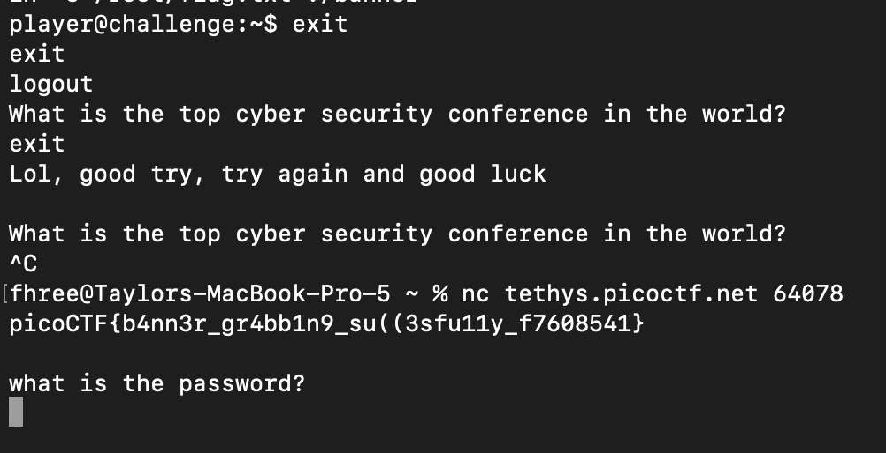

This problem gives us two ports to connect to so I try to netcat to both:

Seeing that the first connection gives us something that looks like a password, I try it out and then answer the following questions. This drops me in a shell.

The problem description mentions that the flag is in the /root directory, so I see if I have access. I do, but I can't read the flag file because I dont have permissions. However, I can read the script.py file beside it which seems to be the program that handled my login to the machine.

Reading through the script I see that the banner is printed upon user login or whatever file is in /home/player/banner.

I know that I can read the root folder and I know that I have control over the files in my home directory so I delete the banner file that is there and create a symbolic link to the /root/flag.txt file with the path /home/player/banner:

Then I logout and log back in again and the flag is printed on login!

