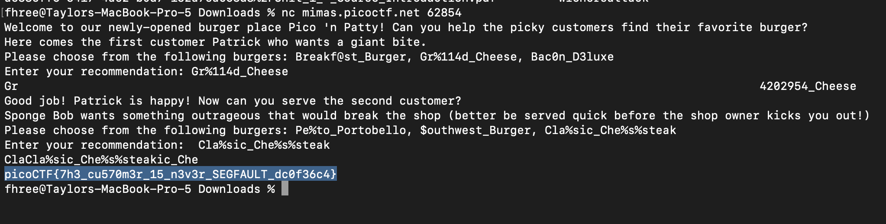

A format string vulnerability is when the user has control over the format specifiers because the programmers decides to directly print some form of user input. Something like:

```
scanf("%s", user_var);
printf(user_var);
```

This causes all sorts of problems like allowing the user to input malicious format specifier payloads that can let us read the stack or take control over the program. To get a better overview of what format string vulnerabilities are and how they can be exploited see [this](https://en.wikipedia.org/wiki/Uncontrolled_format_string) wikipedia article which has a nice overview and then do some googling on your own. In the case of this problem, we are given this source code:

```
#include <stdio.h>
#include <stdlib.h>
#include <string.h>
#include <signal.h>
#include <unistd.h>
#include <sys/types.h>

#define BUFSIZE 32
#define FLAGSIZE 64

char flag[FLAGSIZE];

void sigsegv_handler(int sig) {
    printf("\n%s\n", flag);
    fflush(stdout);
    exit(1);
}

int on_menu(char *burger, char *menu[], int count) {
    for (int i = 0; i < count; i++) {
        if (strcmp(burger, menu[i]) == 0)
            return 1;
    }
    return 0;
}

void serve_patrick();

void serve_bob();


int main(int argc, char **argv){
    FILE *f = fopen("flag.txt", "r");
    if (f == NULL) {
        printf("%s %s", "Please create 'flag.txt' in this directory with your",
                        "own debugging flag.\n");
        exit(0);
    }

    fgets(flag, FLAGSIZE, f);
    signal(SIGSEGV, sigsegv_handler);

    gid_t gid = getegid();
    setresgid(gid, gid, gid);

    serve_patrick();
  
    return 0;
}

void serve_patrick() {
    printf("%s %s\n%s\n%s %s\n%s",
            "Welcome to our newly-opened burger place Pico 'n Patty!",
            "Can you help the picky customers find their favorite burger?",
            "Here comes the first customer Patrick who wants a giant bite.",
            "Please choose from the following burgers:",
            "Breakf@st_Burger, Gr%114d_Cheese, Bac0n_D3luxe",
            "Enter your recommendation: ");
    fflush(stdout);

    char choice1[BUFSIZE];
    scanf("%s", choice1);
    char *menu1[3] = {"Breakf@st_Burger", "Gr%114d_Cheese", "Bac0n_D3luxe"};
    if (!on_menu(choice1, menu1, 3)) {
        printf("%s", "There is no such burger yet!\n");
        fflush(stdout);
    } else {
        int count = printf(choice1);
        if (count > 2 * BUFSIZE) {
            serve_bob();
        } else {
            printf("%s\n%s\n",
                    "Patrick is still hungry!",
                    "Try to serve him something of larger size!");
            fflush(stdout);
        }
    }
}

void serve_bob() {
    printf("\n%s %s\n%s %s\n%s %s\n%s",
            "Good job! Patrick is happy!",
            "Now can you serve the second customer?",
            "Sponge Bob wants something outrageous that would break the shop",
            "(better be served quick before the shop owner kicks you out!)",
            "Please choose from the following burgers:",
            "Pe%to_Portobello, $outhwest_Burger, Cla%sic_Che%s%steak",
            "Enter your recommendation: ");
    fflush(stdout);

    char choice2[BUFSIZE];
    scanf("%s", choice2);
    char *menu2[3] = {"Pe%to_Portobello", "$outhwest_Burger", "Cla%sic_Che%s%steak"};
    if (!on_menu(choice2, menu2, 3)) {
        printf("%s", "There is no such burger yet!\n");
        fflush(stdout);
    } else {
        printf(choice2);
        fflush(stdout);
    }
}

```

Off rip we can see that the sigsev handler prints out a file called flag.txt. So, the way to get the flag is to cause a segfault somehow. Then we can see that first we are supposed to serve Patrick and then Spongebob. To cause a segfault we need to cause a memory error accessing something incorrectly. We can also see that the options to serve Patrick and Spongebob all have format specifiers in them which could cause a segfault if they were dereferenced. Therefore, what we can do is serve them the burgers with the most format specifiers. So for Patrick, I choose to serve him the Gr%114d_Cheese which has the %d specifier in it. Then for Spongebob I decidce to serve him the Cla%sic_Che%s%steak which has 3 %s specifiers in it. These %s specifiers are going to dereference values on the stack and expect them to be strings which will likely not be the case. After choosing that option for Spongebob we cause a segfault and get the flag.

