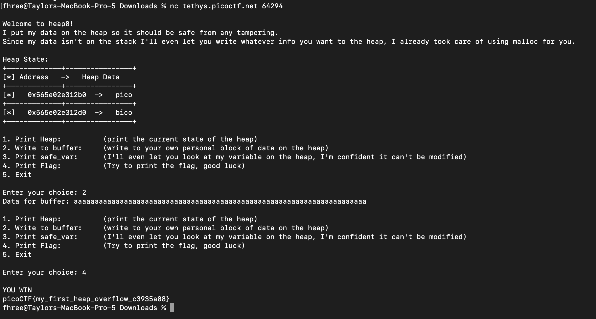

In this challenge we are given source code and a binary that is a 64 bit ELF executable. The source code is below:

```
#include <stdio.h>
#include <stdlib.h>
#include <string.h>

#define FLAGSIZE_MAX 64
// amount of memory allocated for input_data
#define INPUT_DATA_SIZE 5
// amount of memory allocated for safe_var
#define SAFE_VAR_SIZE 5

int num_allocs;
char *safe_var;
char *input_data;

void check_win() {
    if (strcmp(safe_var, "bico") != 0) {
        printf("\nYOU WIN\n");

        // Print flag
        char buf[FLAGSIZE_MAX];
        FILE *fd = fopen("flag.txt", "r");
        fgets(buf, FLAGSIZE_MAX, fd);
        printf("%s\n", buf);
        fflush(stdout);

        exit(0);
    } else {
        printf("Looks like everything is still secure!\n");
        printf("\nNo flage for you :(\n");
        fflush(stdout);
    }
}

void print_menu() {
    printf("\n1. Print Heap:\t\t(print the current state of the heap)"
           "\n2. Write to buffer:\t(write to your own personal block of data "
           "on the heap)"
           "\n3. Print safe_var:\t(I'll even let you look at my variable on "
           "the heap, "
           "I'm confident it can't be modified)"
           "\n4. Print Flag:\t\t(Try to print the flag, good luck)"
           "\n5. Exit\n\nEnter your choice: ");
    fflush(stdout);
}

void init() {
    printf("\nWelcome to heap0!\n");
    printf(
        "I put my data on the heap so it should be safe from any tampering.\n");
    printf("Since my data isn't on the stack I'll even let you write whatever "
           "info you want to the heap, I already took care of using malloc for "
           "you.\n\n");
    fflush(stdout);
    input_data = malloc(INPUT_DATA_SIZE);
    strncpy(input_data, "pico", INPUT_DATA_SIZE);
    safe_var = malloc(SAFE_VAR_SIZE);
    strncpy(safe_var, "bico", SAFE_VAR_SIZE);
}

void write_buffer() {
    printf("Data for buffer: ");
    fflush(stdout);
    scanf("%s", input_data);
}

void print_heap() {
    printf("Heap State:\n");
    printf("+-------------+----------------+\n");
    printf("[*] Address   ->   Heap Data   \n");
    printf("+-------------+----------------+\n");
    printf("[*]   %p  ->   %s\n", input_data, input_data);
    printf("+-------------+----------------+\n");
    printf("[*]   %p  ->   %s\n", safe_var, safe_var);
    printf("+-------------+----------------+\n");
    fflush(stdout);
}

int main(void) {

    // Setup
    init();
    print_heap();

    int choice;

    while (1) {
        print_menu();
	int rval = scanf("%d", &choice);
	if (rval == EOF){
	    exit(0);
	}
        if (rval != 1) {
            //printf("Invalid input. Please enter a valid choice.\n");
            //fflush(stdout);
            // Clear input buffer
            //while (getchar() != '\n');
            //continue;
	    exit(0);
        }

        switch (choice) {
        case 1:
            // print heap
            print_heap();
            break;
        case 2:
            write_buffer();
            break;
        case 3:
            // print safe_var
            printf("\n\nTake a look at my variable: safe_var = %s\n\n",
                   safe_var);
            fflush(stdout);
            break;
        case 4:
            // Check for win condition
            check_win();
            break;
        case 5:
            // exit
            return 0;
        default:
            printf("Invalid choice\n");
            fflush(stdout);
        }
    }
}

```

Initially we can see that this program is manipulating the heap in some way. It begins setup by calling the init function, which mallocs two different blocks in the heap and then copies the strings "pico" and "bico" into those blocks. Then the program prints out the heap which shows us the addresses and the data stored in each of the two allocated blocks  


Then we are required to make a choice. We can either print the heap, write our own personal block of data, print the safe variable, check the win condition, or exit. The win condition function is interesting. We see that the flag is printed when the safe variable "bico" is changed. So, to get the flag, we need to find some way to change that variable. Further, in the write_buffer() function, the program uses the unsafe function scanf to take user input and stores it in the input_data variable. The glaring issue is that input_data was allocated to be 5 bytes so if the user inputs more than 5 bytes to scanf we are going to cause a heap overflow and overwrite some buffer that we are not supposed to have control of. In this case, it is the safe variable. This is our avenue for changing the safe variable so what I decide to do is choose option 2, write a bunch of a's, and then check the win condition:



The heap can be a complicated topic if you have never learned about it before. [Here](https://ir0nstone.gitbook.io/notes/binexp/) is a resource to learn more about the heap and the stack in the context of binary exploitation and [here](https://www.geeksforgeeks.org/stack-vs-heap-memory-allocation/) is a resource that covers the basics of both (how they work and what they are for). Happy reading!