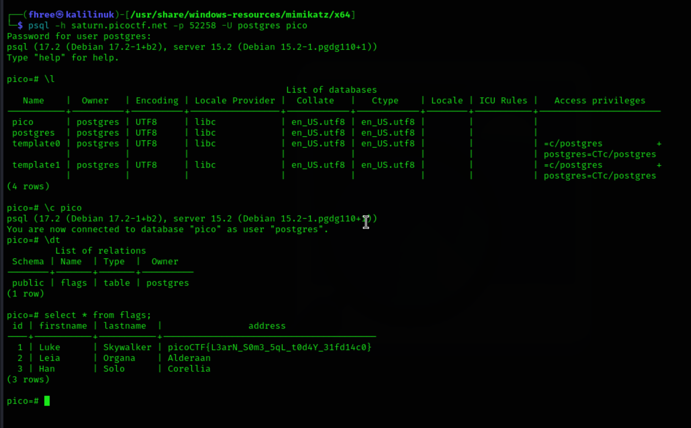

This challenge has you immediately connect to a PostGreSQL database using provided creds. I use kali linux where there is a postgres client and type in the password. 

Once Im in, I list the databases, select to use the pico one, query the data in that table, and then the flag is dumped. This is really an exercise in being able to find postgres commands as they are different than the typical mySQL commands you may be more familiar with.

