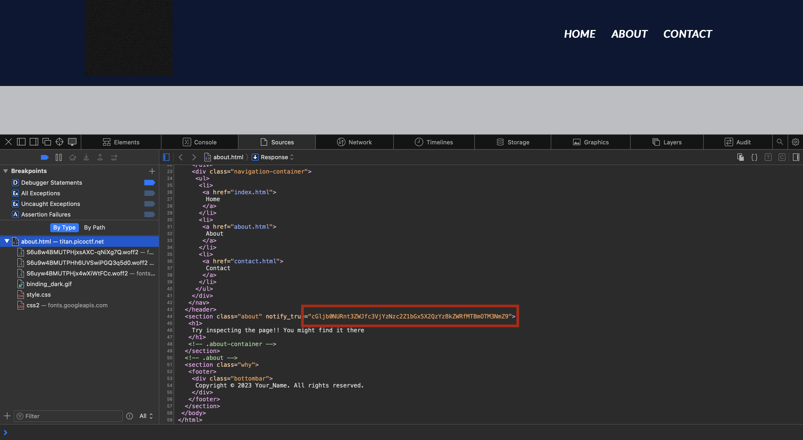

When we launch the challenge we enter a website with no flag seemingly present.

The next task is to inspect the source code to see if we find anything interesting in there. I am on mac using safari so to inspect source I had to go to Safari -> Settings -> Adavanced and then click on "Show features for web developers." After this I could hit option + command + u to bring up the source.

Then I clicked around on different pages until I saw the highlighted string of base64 encoded something:

Then, after decoding it into text, we get our flag!

